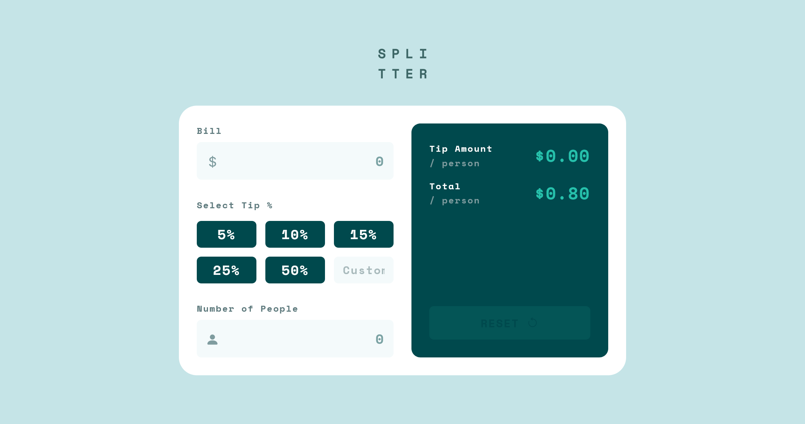
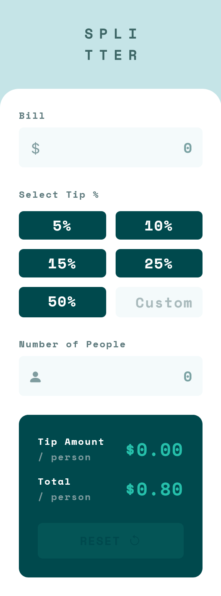

# Frontend Mentor - Tip calculator app solution

This is a solution to the [Tip calculator app challenge on Frontend Mentor](https://www.frontendmentor.io/challenges/tip-calculator-app-ugJNGbJUX). Frontend Mentor challenges help you improve your coding skills by building realistic projects.

## Table of contents

- [Overview](#overview)
  - [The challenge](#the-challenge)
  - [Screenshot](#screenshot)
  - [Links](#links)
- [My process](#my-process)
  - [Built with](#built-with)
  - [What I learned](#what-i-learned)
  - [Continued development](#continued-development)
  - [Useful resources](#useful-resources)
- [Author](#author)
- [Acknowledgments](#acknowledgments)

## Overview

### The challenge

Users should be able to:

- View the optimal layout for the app depending on their device's screen size
- See hover states for all interactive elements on the page
- Calculate the correct tip and total cost of the bill per person

Get up and running with few steps:

- Clone the repo
  ```bash
  git clone git@github.com:vickbk/tip-calculator-app.git
  ```
- Install the dependancies
  ```bash
  pnpm install
  ```
- Start the server
  ```bash
  pnpm dev
  ```
- Build a production preview
  ```bash
  pnpm build
  ```
- Preview the built file
  ```bash
  pnpm preview
  ```

### Screenshot




### Links

- Solution URL: [Github Repo](https://github.com/vickbk/tip-calculator-app)
- Live Site URL: [Github pages](https://vickbk.github.io/tip-calculator-app/)

## My process

### Built with

- Semantic HTML5 markup
- CSS custom properties
- Mobile-first workflow
- [SASS](https://sass-lang.com/) - CSS Preprocessor
- [Tailwindcss](https://tailwindcss.com/) - CSS framework
- [React](https://reactjs.org/) - JS library
- [Vite](https://vite.dev/) - A build tool for the web

### What I learned

In this project I got started with frontend unit testing and learnt to test functions and components.

```js
describe("Labelled Input", () => {
  it("should show error on empty focusout", async () => {
    render(
      <LabelledInput label="Test Label" icon="bi-test" name="test-name" />,
    );
    const input = screen.getByPlaceholderText("0");
    expect(input).toBeInTheDocument();
    act(() => {
      input.focus();
      input.blur();
    });
    const errorMessage = await screen.findByText("Can't be zero");
    expect(errorMessage).toBeVisible();
  });
});
```

### Continued development

As for coming days I will keep practicing testing more on test first instead of unit first.

### Useful resources

- [FEM Frontend Testing Introduction](https://www.frontendmentor.io/learning-paths/introduction-to-front-end-testing-kacF_IJQO5) - This helped me on understanding frontend testing and getting started

## Author

- Github - [@vickbk](https://github.com/vickbk)
- Frontend Mentor - [@vickbk](https://www.frontendmentor.io/profile/vickbk)
- Twitter - [@Vick_bk8](https://x.com/Vick_bk8)

## Acknowledgments

For this project I use most of the knowlegde I got from the frontend roadmap, frontendmentor for HTML & css tricks and technics, accessibility and various developement techniques...
